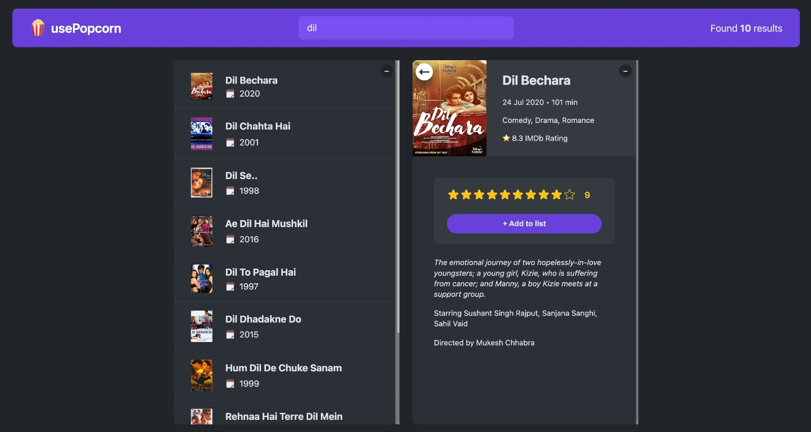
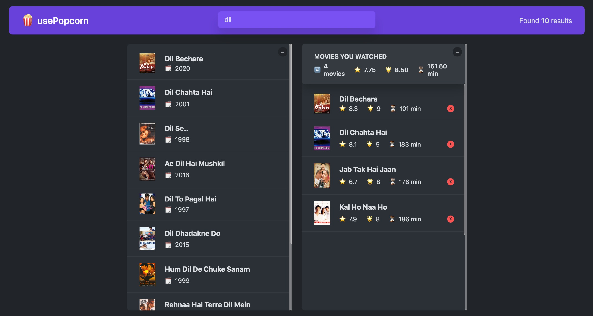

# usePopcorn

The usePopcorn React app allows users to explore and track movies by fetching data from a movie API. Users can rate films on a scale and create a personal watched list to manage their viewing history. With features like search and filtering, it offers a user-friendly interface for discovering new movies.

## To Visit <a href="https://kumarharsh13.github.io/use-popcorn/" target="_blank">Click Here</a>

## Screenshot

- Search Move 
- Wactch List 
